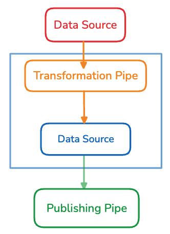
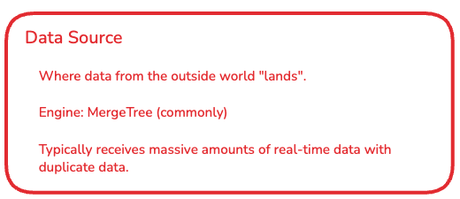
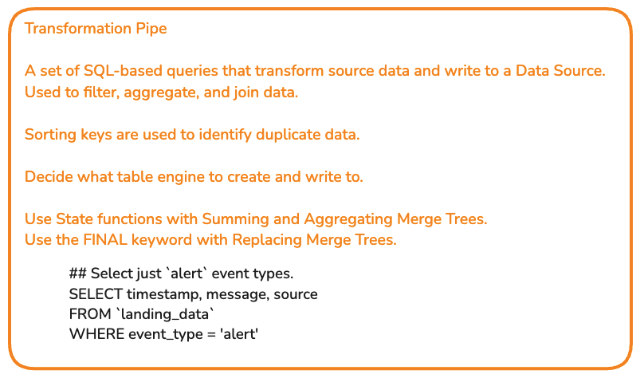
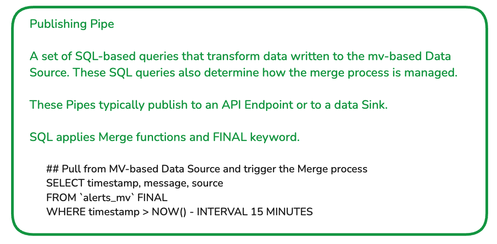

# Tinybird Workshop on Materialized Views

This repository is a companion piece to the 'Materialized Views' workshop. The intended audience of this workshop are folks who have some experience with Tinybird and are interested in learning how Materialized Views are implemented with Tinybird.


## Source data

In this workshop we start with a Python data generator script that is creating a stream of *estore events*. These are product-related events that users trigger while navigating an estore app. Each event includes an *action type* that describes the action the customer took. 

### `action` types

Action types include:

* View
* Cart
* Uncart
* Purchase 
* Return

The script enforces some rules:
* Before it can be purchased, the product must be in the customer's cart. 
* Only purchased products can be returned.

## What is a Materialized View?

Materialized Views consists of two components. First, there is a *transformation* Pipe that reads from a Data Source, applies one or more Nodes of SQL, and write to the second component, a new Data Source. 



Here are descriptions of these components:






Data generator posts product-related events:

* View
* Cart
* Uncart
* Purchase
* Return

An example `view` event: 

```json
{
    "customer_id": "customer_464",
    "product": {
        "product_id": "product_17"
    },
    "action": "view",
    "timestamp": "2024-09-19T16:33:11"
}
```

An example `purchase` event. These events add a `price` attribute: 

```json
{
    "customer_id": "customer_27",
    "product": {
        "product_id": "product_499",
        "price": 23.99
    },
    "action": "purchase",
    "timestamp": "2024-09-19T16:31:13"
}
```